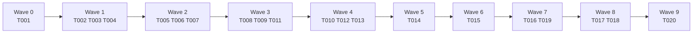

# Tasks: CSV Upload and Auto EDA

**Branch**: `001-upload-auto-eda`  
**Input**: Design documents from `/specs/001-upload-auto-eda/`  
**Prerequisites**: plan.md ✅ · spec.md ✅ · research.md ✅ · data-model.md ✅ · contracts/ ✅ · quickstart.md ✅

**Tests**: No automated tests in scope — demo build. Manual smoke test via `quickstart.md`.

**Organization**: Tasks grouped by user story. US1 covers the full backend pipeline. US2 and US3 cover distinct frontend rendering layers that build incrementally on the same agent output.

---

## Format: `[ID] [P?] [Story] Description`

- **[P]**: Can run in parallel (different files, no shared dependencies within the same wave)
- **[Story]**: User story this task belongs to (US1, US2, US3)
- No story label = Setup / Foundational / Polish

---

## Phase 1: Setup (Shared Infrastructure)

**Purpose**: Project skeleton, dependency manifests, environment config. Nothing runs yet — just structure.

- [X] T001 Create directory structure: `backend/`, `backend/agents/`, `backend/tools/`, `backend/utils/`, `frontend/app/upload/`, `frontend/components/`, `frontend/lib/`, `data/uploads/`
- [X] T002 [P] Create `backend/requirements.txt` with all deps: fastapi, uvicorn[standard], python-multipart, aiosqlite, pandas, numpy, scipy, langchain, langchain-openai, langgraph, python-dotenv
- [X] T003 [P] Bootstrap `frontend/` as Next.js 14 App Router project (TypeScript strict, Tailwind CSS); add Recharts and install all deps via `npm install`
- [X] T004 Create `.env` at repo root with all env vars: `OPENAI_API_KEY`, `DATABASE_URL=sqlite+aiosqlite:///./data/app.db`, `UPLOAD_DIR=./data/uploads`, `MAX_FILE_SIZE_MB=50`, `PYTHON_REPL_TIMEOUT_SEC=30`

**Checkpoint**: Directory tree exists, deps are declared, env vars are set. No running code yet.

---

## Phase 2: Foundational (Blocking Prerequisites)

**Purpose**: Database schema + Pydantic models (backend) and TypeScript types (frontend). Everything downstream depends on these contracts being correct.

**⚠️ CRITICAL**: No user story work can begin until this phase is complete.

- [X] T005 [P] Create `backend/database.py`: `create_tables()` (creates `uploads` + `jobs` tables per data-model.md schema), `create_upload()`, `update_upload_counts()`, `create_job()`, `update_job()`, `get_job()` — all async using `aiosqlite`; `DATABASE_URL` from env
- [X] T006 [P] Create `backend/models.py`: Pydantic v2 models — `InsightItem`, `ChartSpec`, `TableData`, `CanvasResponse`, `UploadResponse` (`upload_id`, `job_id`, `slug`), `JobResponse` (`job_id`, `status`, `result: CanvasResponse | None`, `error: str | None`); strict field types, no `Any`
- [X] T007 [P] Create `frontend/lib/types.ts`: TypeScript interfaces mirroring models.py exactly — `InsightItem`, `ChartSpec`, `TableData`, `CanvasResponse`, `UploadResponse`, `JobResponse`; all field types strict, no `any`

**Checkpoint**: Backend schema + models consistent with `data-model.md`. Frontend types consistent with TypeScript interfaces in `contracts/`. Ready for implementation.

---

## Phase 3: User Story 1 — Upload a CSV and See an Instant Data Profile (Priority: P1) 🎯 MVP

**Goal**: User drops a CSV → file is parsed + coerced → AutoEDA agent profiles it → canvas shows stat cards, quality info, and charts. "Continue to Context →" becomes active.

**Independent Test**: Upload `ecommerce_orders_2024.csv` via the UI. Within 60 seconds, the canvas shows at minimum: 4 stat cards (rows, nulls, duplicates, date range), at least one quality warning, at least 2 charts. "Continue" button activates.

### Backend Pipeline

- [X] T008 [US1] Create `backend/utils/csv_parser.py`: `parse_csv_to_sqlite(upload_id, file_path)` — reads CSV with pandas, applies the 5 coercion rules in order (whitespace strip → currency strip → date normalisation → numeric coercion → null preservation), writes result to `raw_{upload_id}` SQLite table, calls `update_upload_counts()`; no LLM involved (depends on T005)
- [X] T009 [US1] Create all 4 AutoEDA tools **and** the AutoEDA agent together — these are tightly coupled and best written as a unit: (depends on T005, T006, T008)
  - `backend/tools/dataframe.py`: `get_dataframe_profile(upload_id)` — reads `raw_{upload_id}`, returns shape/dtypes/null counts/nunique/describe stats; sync read-only
  - `backend/tools/python_repl.py`: `run_python_analysis(upload_id, code)` — sandboxed `exec()` against `raw_{upload_id}` dataframe; allowed imports: pandas, numpy, scipy.stats, datetime; 30s timeout via `PYTHON_REPL_TIMEOUT_SEC`; returns stdout string or error string (never raises)
  - `backend/tools/chart.py`: `generate_chart_spec(chart_type, title, x_label, y_label, data)` — validates chart_type against allowed set, validates data is `list[dict]` with `x`/`y` keys, returns normalised `ChartSpec` dict; sync
  - `backend/tools/autoeda_writer.py`: `write_autoeda_result(upload_id, canvas_response)` — async; serialises `CanvasResponse` dict to JSON, calls `update_job()` with `status="done"` and `result=json`; returns `True` on success, error string on failure
  - `backend/agents/autoeda.py`: `SYSTEM_PROMPT` constant (role persona from spec); LangGraph `StateGraph` single-node agent; binds all 4 tools; runs 7 fixed analyses via `run_python_analysis`; chart selection logic (histogram/bar/scatter/line/heatmap per data condition); calls `write_autoeda_result` last; max 5 charts
- [X] T010 [US1] Create `backend/main.py`: FastAPI app setup with CORS + lifespan (`create_tables()` on startup); `POST /api/upload` route (validate file type + size, save to `UPLOAD_DIR`, `create_upload()`, `create_job()`, schedule `run_autoeda_pipeline()` via `BackgroundTasks`, return `UploadResponse`); `GET /api/jobs/{job_id}` route (calls `get_job()`, returns `JobResponse`, 404 if missing); `run_autoeda_pipeline()` background fn (`update_job(running)` → `parse_csv_to_sqlite()` → `autoeda_agent.ainvoke()` → error handler sets `update_job(error)`) (depends on T005, T006, T008, T009)

### Frontend Wiring

- [X] T011 [P] [US1] Create `frontend/lib/api.ts` and `frontend/lib/hooks.ts` together — coupled by design: (depends on T007)
  - `api.ts`: `uploadFile(file: File): Promise<UploadResponse>` (POST /api/upload, multipart), `getJob(jobId: string): Promise<JobResponse>` (GET /api/jobs/{jobId}); all typed, no raw `fetch()` in components
  - `hooks.ts`: `useUploadId()` — stores/retrieves `upload_id` + `slug` from `localStorage` + React context; `usePolling(jobId: string, interval?: number)` — polls `getJob()` every 2s, stops on `done`/`error`, returns `{ status, result, error }`
- [X] T012 [P] [US1] Create `frontend/app/page.tsx` (root redirect to `/upload`) and scaffold `frontend/app/upload/page.tsx`: upload zone (drag-and-drop + file picker), file metadata panel (filename in monospace, row/col count, file size, encoding), upload progress state, left panel layout per spec wireframe; wire `uploadFile()` on file select → store IDs via `useUploadId()` → start `usePolling()` (depends on T007, T011)

**Checkpoint (US1 partial)**: Upload works end-to-end — file uploads, job is created, background agent runs, polling returns `done`. Canvas placeholder is visible but not yet rendering. "Continue" button not yet active.

---

## Phase 4: User Story 2 — Understand Data Quality at a Glance (Priority: P2)

**Goal**: Quality warnings surface visibly on the canvas — columns with >5% nulls, duplicate counts in amber, outlier notes. User can assess dataset health before proceeding.

**Independent Test**: Upload demo CSV. Canvas shows at least two warning items identifying specific columns with quality issues, each with its percentage or count.

- [X] T013 [P] [US2] Create `frontend/components/InsightCards.tsx`: renders a single `InsightItem`; variants: `stat` (label + large monospace value + sub-label, optional `color` tinting), `warning` (amber left-border card with icon + text + highlighted column name in monospace), `text` (narrative card), `badge` (pill badge); matches design system colours from prototype (`--accent3` for amber, `--danger` for red, `--accent` for green)
- [X] T014 [US2] Create `frontend/components/Canvas.tsx`: renders full `CanvasResponse`; top section = 4-column stat grid (maps `type: "stat"` InsightItems); middle section = warning list (maps `type: "warning"` InsightItems, shown only if any exist); bottom section = charts placeholder (populated in US3); header with "Auto EDA — Analysis Canvas" label + status badge; loading skeleton state when `status = "running"` (depends on T013)
- [X] T015 [US2] Wire `Canvas` into `frontend/app/upload/page.tsx`: import and render `Canvas` in the right panel; pass `result` (from `usePolling`) to `Canvas`; show skeleton while `status = "pending"` or `"running"`; on `status = "done"` render stat cards + quality warnings; data quality overview section in left panel (column-level null % bars per prototype) (depends on T012, T014)

**Checkpoint (US2)**: Upload demo CSV → canvas shows 4 stat cards including amber "200 duplicates" + at least 2 quality warning banners for `revenue` nulls and `discount_pct` outliers.

---

## Phase 5: User Story 3 — View Meaningful Charts Without Configuration (Priority: P3)

**Goal**: Agent-selected charts render on the canvas — histograms, bar charts, scatter plots, line charts — with correct titles and axis labels. No user configuration needed.

**Independent Test**: Upload demo CSV. At least 2 charts appear with titles, axis labels, and data matching the dataset. No more than 5 charts shown.

- [X] T016 [P] [US3] Create `frontend/components/ChartRenderer.tsx`: Recharts wrapper that renders a single `ChartSpec`; supports all 6 types (`bar` → `BarChart`, `histogram` → `BarChart` with no gap, `line` → `LineChart`, `scatter` → `ScatterChart`, `heatmap` → custom grid, `boxplot` → `ComposedChart`); responsive container; axis labels from `x_label`/`y_label`; colour palette matches prototype design tokens; no `any` types
- [X] T017 [US3] Add charts section to `Canvas.tsx` and activate "Continue" button: render `charts` array using `ChartRenderer` in a 2-column grid (matches prototype `charts-grid`); enable "Continue to Context →" button in `upload/page.tsx` only when `status === "done"`; button navigates to `/context` (depends on T015, T016)

**Checkpoint (US3)**: Full demo smoke test — upload CSV → stat cards + warnings + charts all render. "Continue" button active. All US1/US2/US3 acceptance criteria met.

---

## Phase 6: Polish & Cross-Cutting Concerns

**Purpose**: Error resilience, NavBar state, and final smoke test validation.

- [X] T018 [P] Create `frontend/components/NavBar.tsx`: 3-step progress bar; step 1 `active` on upload page; `locked` state (opacity + `cursor-not-allowed`) for steps 2 and 3 until prerequisites complete; `done` state (checkmark) for step 1 after EDA completes; reads step unlock state from `useUploadId()` context (depends on T012)
- [X] T019 [P] Add error state to `frontend/app/upload/page.tsx`: when `usePolling` returns `status === "error"`, show error message card in canvas area with the `error` string + a "Try Again" button that clears state and re-shows the upload zone; wrap `uploadFile()` call in try/catch for network errors (depends on T015)
- [X] T020 Run end-to-end smoke test per `quickstart.md`: start backend + frontend, upload demo CSV, verify all 6 success criteria from spec.md are met, inspect SQLite `uploads` + `jobs` tables, confirm `raw_{upload_id}` table exists with coerced data (depends on T017, T018, T019)

**Checkpoint**: Feature complete. All spec success criteria verified manually.

---

## Dependencies & Execution Order

### Phase Dependencies

- **Phase 1 (Setup)**: No dependencies — start immediately
- **Phase 2 (Foundational)**: Requires Phase 1 — BLOCKS all phases below
- **Phase 3 (US1)**: Requires Phase 2 — backend pipeline + frontend scaffold
- **Phase 4 (US2)**: Requires T012 (page scaffold) — quality display layer
- **Phase 5 (US3)**: Requires T015 (canvas wired) — chart rendering layer
- **Phase 6 (Polish)**: Requires T017 (full canvas) — error states + smoke test

### User Story Dependencies

- **US1 (P1)**: Starts after Phase 2 — independent of US2/US3
- **US2 (P2)**: Starts after T012 (US1 page scaffold) — adds quality rendering on top
- **US3 (P3)**: Starts after T015 (US2 canvas wired) — adds chart rendering on top
- **US2 and US3 are sequential within the frontend rendering stack** — each builds on the Canvas component from the previous phase

### Parallel Opportunities Within US1

```
After Phase 2 completes, these US1 tasks can run in parallel:
  - T008 (csv_parser) — no overlap with T011
  - T009 (tools + agent) — no overlap with T011
  - T011 (api.ts + hooks.ts) — frontend only
  - T012 (page scaffold) — depends on T011, but can start once T011 is done
T010 (main.py routes) requires T008 and T009 — wire last
```

---

## Implementation Strategy

### MVP (User Story 1 Only)

1. Phase 1: Setup (T001–T004)
2. Phase 2: Foundation (T005–T007)
3. Phase 3: US1 backend (T008 → T009 → T010) + frontend (T011, T012 in parallel)
4. **STOP**: Verify upload → job → polling works via backend logs
5. Phase 4: US2 canvas (T013 → T014 → T015)
6. **DEMO**: All stat cards + quality warnings visible

### Incremental Delivery

1. Setup + Foundation → structural skeleton
2. Backend pipeline (T008–T010) → agent verified via API call
3. Frontend scaffold + hooks (T011–T012) → upload flow works, no canvas yet
4. Quality canvas (T013–T015) → MVP demo-able
5. Chart rendering (T016–T017) → full feature demo
6. Polish (T018–T020) → production-quality demo

---

## Notes

- `[P]` tasks are in the same execution wave and target different files — safe to dispatch as parallel subagents
- `[US1]`/`[US2]`/`[US3]` labels trace each task back to its acceptance scenario in `spec.md`
- T009 intentionally bundles all 4 tools + the agent — they share state (upload_id), share the same tool interface conventions, and are best reviewed as a unit. A capable implementer can write all 5 files in one session.
- Commit after each Phase checkpoint — allows rollback to any validated state
- Do not add endpoints beyond `POST /api/upload` and `GET /api/jobs/{job_id}` — per project guidelines

---

## Subagent dispatch map

| Task ID | subagent_type | Skills to read first | Rationale |
|---------|---------------|---------------------|-----------|
| T001 | shell | — | Directory creation + scaffolding commands |
| T002 | shell | — | Write requirements.txt, no code analysis needed |
| T003 | nextjs-developer | — | Next.js 14 App Router bootstrap + Tailwind config |
| T004 | shell | — | Write .env file |
| T005 | fastapi-developer | — | SQLite schema + async helper functions in FastAPI project |
| T006 | fastapi-developer | — | Pydantic v2 models for FastAPI project |
| T007 | nextjs-developer | — | TypeScript strict interfaces for Next.js project |
| T008 | python-pro | — | Pure Python CSV/pandas utility with coercion logic |
| T009 | ai-engineer | — | LangGraph agent + LangChain tools; complex AI pipeline |
| T010 | fastapi-developer | — | FastAPI routes + BackgroundTasks wiring |
| T011 | nextjs-developer | — | TypeScript API wrappers + React hooks for Next.js |
| T012 | nextjs-developer | frontend-design | Next.js page + upload zone UI, matches prototype design |
| T013 | nextjs-developer | frontend-design | React component with colour variants, matches prototype |
| T014 | nextjs-developer | frontend-design | Shared Canvas renderer with loading state |
| T015 | nextjs-developer | frontend-design | Wire Canvas into page, skeleton states |
| T016 | nextjs-developer | frontend-design | Recharts wrapper for 6 chart types |
| T017 | nextjs-developer | frontend-design | Wire charts + activate Continue button |
| T018 | nextjs-developer | frontend-design | NavBar with locked/done/active step states |
| T019 | nextjs-developer | — | Error state + retry UX in upload page |
| T020 | shell | — | Smoke test commands per quickstart.md |

---

## Task dependency graph (Task IDs)

- T001 → T002
- T001 → T003
- T001 → T004
- T002 → T005
- T002 → T006
- T003 → T007
- T005 → T008
- T005 → T009
- T006 → T009
- T006 → T010
- T007 → T011
- T008 → T010
- T009 → T010
- T010 → T015 (backend API must work before full canvas wiring)
- T011 → T012
- T012 → T015
- T012 → T018
- T013 → T014
- T014 → T015
- T015 → T016
- T015 → T019
- T016 → T017
- T017 → T020
- T018 → T020
- T019 → T020

---

## Execution waves

| Wave | Task IDs | Notes |
|------|----------|-------|
| Wave 0 | T001 | Repo structure — unblocks everything |
| Wave 1 | T002, T003, T004 | Deps + env in parallel — all depend only on T001 |
| Wave 2 | T005, T006, T007 | Foundation layer — backend models + frontend types in parallel |
| Wave 3 | T008, T009, T011 | CSV parser, tools+agent, frontend API/hooks — all depend on wave 2, no file overlap |
| Wave 4 | T010, T012, T013 | Routes (needs T008+T009), page scaffold (needs T011), InsightCards (needs T007) |
| Wave 5 | T014 | Canvas component (needs T013) |
| Wave 6 | T015 | Wire canvas into page (needs T010, T012, T014) |
| Wave 7 | T016, T019 | ChartRenderer (needs T015), error state (needs T015) — different files |
| Wave 8 | T017, T018 | Charts in Canvas + Continue button (needs T016), NavBar (needs T012) |
| Wave 9 | T020 | Smoke test — needs everything |


